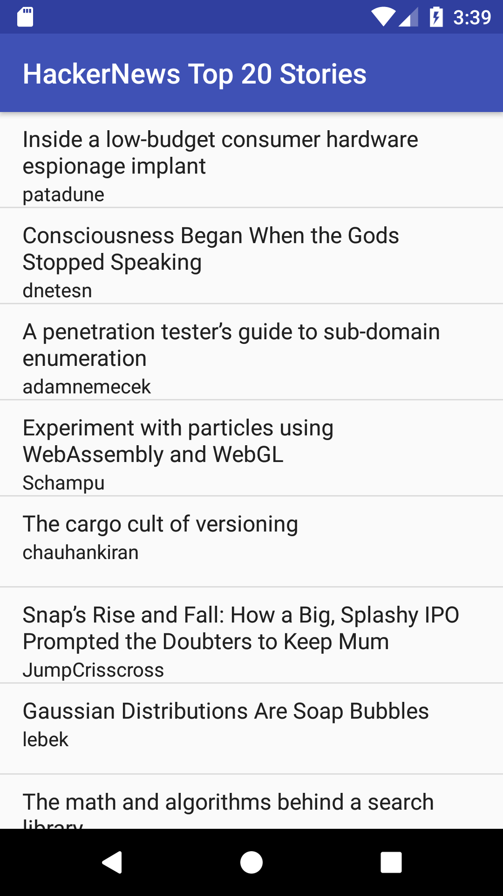
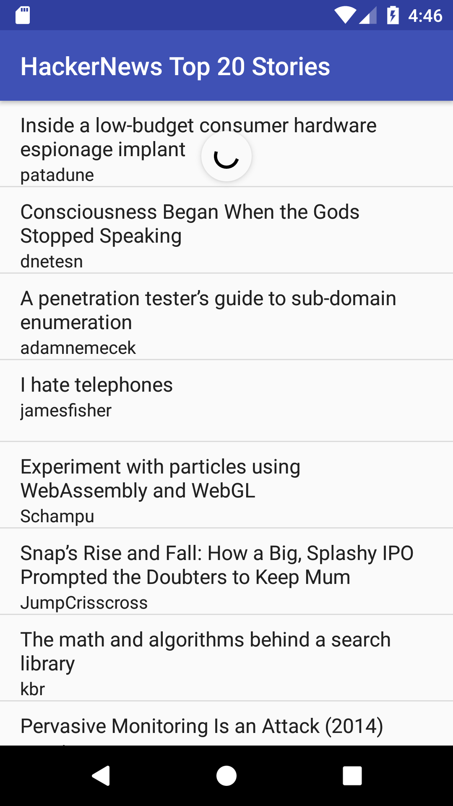
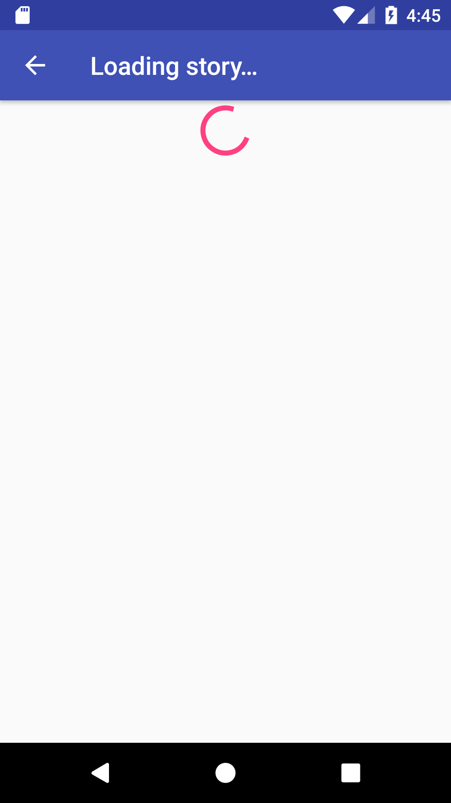
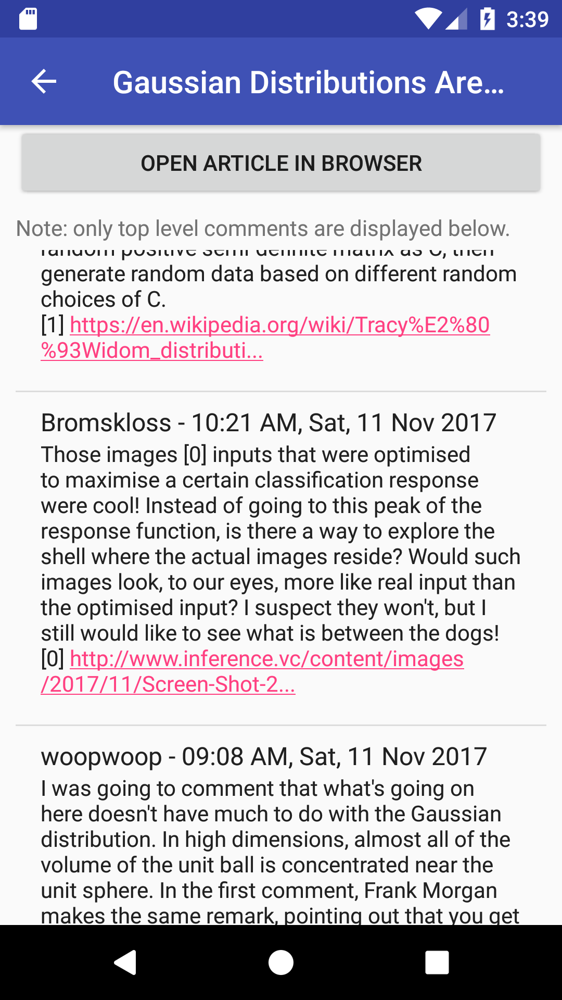
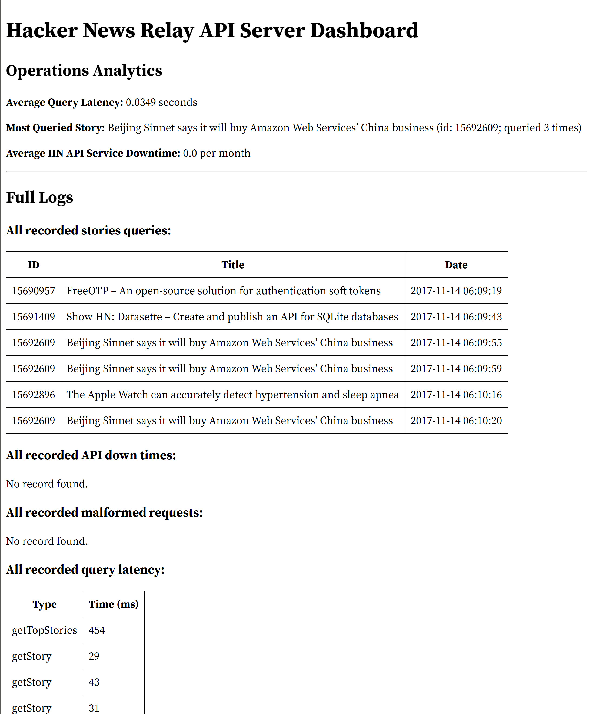

# Hacker News Top Stories Android App

**Author:** Stephen Xie


## Project Description

This native Android app will allow users to browse through top stories of [Hacker News](https://news.ycombinator.com/). The app will display a list of Hacker News' latest top stories; when user clicks on one of the stories, he or she will be able to view the web link the story is referring to and the top-level comments made to that story. The user will also be able to pull-to-refresh the top stories list to see the latest changes.

Behind the curtain, the app makes `GET` requests to a custom RESTful web service built with [Glassfish](https://javaee.github.io/glassfish/), the reference Java EE application server based on Apache Tomcat and Grizzly, which acts as a proxy between the app and the [official Hacker News API](https://github.com/HackerNews/API). The server does all of the computation-heavy jobs (e.g. querying article title and author for each story ID, sorting comments in reverse-chronological order, etc.), then it returns a JSON response which will be interpreted and displayed appropriately by the frontend app.

The backend server has an additional feature of logging API usage to a remote database server. This project uses MongoDB as the logging database. MongoDB provides a powerful (though lacking clear documentations) aggregation functionality that makes data analytics on NoSQL databases easier and more efficient. This is demonstrated through the implementation of a logging dashboard.

Here're some screenshots of the two activities I implemented for the app:

* `TopStoriesActivity` (Main page of the app):





* `StoryActivity` (Page for individual stories users clicked on):





And here's a screenshot of the logging dashboard (accessed via http://server-base-address/dashboard):




## Some Notes

1. This is just a quick tryout of full-stack native Android development. Therefore, some of the implementations in the app may not be optimal. For example, the app doesn't cache the list before the `TopStoriesActivity` is destroyed, causing it to repeatedly issue requests to the backend API every time user rotates the device or switches to `StoryActivity`. A solution to this problem is to save the current state via `onSaveInstanceState()`, then restore it through the `Bundle` parameter in `onCreate()`, but that involves some advanced applications of activity lifecycle which is out of the project's requirements and will complicate the current implementation (a bit :D).

2. The address to the backend server is saved in an enum class `API_URL.java` inside the same directory where the app's main code resides. Change the Heroku base URL to `http://10.0.2.2:8080` before running the Android project in AVD if the server runs on `localhost`.

3. I've redacted the mLab MongoDB URI in the code. You should supply your own mLab URI (or URI to a local MongoDB database) in `APIUsageLogger.java` before running the server.

4. Since Android Studio has a 100-character limitation on file paths, I suggest that the Android project be placed in your hard drive's root directory, otherwise you may see confusing error messages that prevent you from building the project.

5. To deploy the server to Heroku: install [Heroku CLI](https://devcenter.heroku.com/articles/heroku-cli) and [Heroku CLI Deploy Plugin](https://github.com/heroku/heroku-cli-deploy), then clean and build the project in Netbeans. You'll find a `.war` file generated in the `dist` directory. Deploy this file to your Heroku app with `heroku war:deploy <path_to_war_file> --app <app_name>`.


## Some More Implementation Details

The app is compatible with API level 25 (Android 7.1.1 Nougat) and above. It makes two `GET` requests to the backend server:

- Get the IDs, titles, author IDs and post time of the top 20 HN stories: https://afternoon-dawn-96415.herokuapp.com/hackernews-api/top-stories.

- Get the details of a story with a given ID: https://afternoon-dawn-96415.herokuapp.com/hackernews-api/story/{id}.

As mentioned previously, the backend handles all data processing. The app simply parses and displays the information returned from the server.

Here're two examples of the JSON response returned by the backend:

- `/hackernews-api/top-stories`:

```javascript
[{
        "by": "patadune",
        "id": "15676737",
        "time": 1510414741,
        "title": "Inside a low-budget consumer hardware espionage implant"
    }, {
        "by": "adamnemecek",
        "id": "15676951",
        "time": 1510417900,
        "title": "A penetration tester\u2019s guide to sub-domain enumeration"
    }, ...
]
```

- `/hackernews-api/story/15677206`:

```javascript
{
    "comments": [{
            "by": "lytedev",
            "id": "15678225",
            "text": "This is super neat! I wonder how much work went into this. Is this official or a port by somebody?",
            "time": 1510434754
        }, {
            "comments": ["15678300"],
            "by": "giancarlostoro",
            "id": "15678170",
            "text": "Really slow to load, but once it does it seems to be pretty stable. No bad performance so far either, at least for me. Using a Macbook Air.",
            "time": 1510434011
        }
    ],
    "by": "markdog12",
    "id": "15677206",
    "time": 1510421952,
    "title": "Godot Editor ported to WebAssembly",
    "url": "https://www.godot.online/wasm/"
}
```

The backend is based on HttpServlet, as JAX-RS / Jersey is not recommended in the project.The backend server loosely follows a simple MVC design, although all codes are included inside `HackerNewsAPIServlet.java`:

- **Model:** the inner classes `Story` and `Comment` and all the related methods: `getTopStories`, `viewStory`, `getStory`, `getComments` and `fetch`.

- **View:** there's no apparent "view files" in the project; I used `org.json` to generate the response, although later on I switched to `Gson` to parse JSON strings in the Android app. Using JSON libraries seems to be a faster, less-prone-to-error way to deal with JSON than using JSP as templates (although JSPs may become more helpful for XML).

- **Controller:** the servlet related codes, including `doGet`, `doPost` (only returns `405 METHOD NOT ALLOWED` whatsoever) and `getServletInfo`.

I'm not sure why it was not recommended to use JAX-RS in this assignment though. Using annotations to denote request methods and relative paths is much faster and less prone to error (e.g. we don't need to use `getPathInfo` to parse the address ourselves; this makes changing path structures easier too) than using plain Java Servlet.

Regarding the logging functionality, there're 6 pieces of information the server logs:

1. Time used to retrieve a top story list from the HackerNews API.

2. Time used to retrieve details of a single story from the HackerNews API.

3. Details of a story being accessed, including access date, story ID and story title.

4. Time when this server finds the HackerNews API service is down.

5. Time and additional information when a user sends in malformed `GET` request to the API service; note that the address of the API service starts with `/hackernews-api/`.

6. Time when a user sends in forbidden `POST` request.

Three data analytics jobs are done based on these 6 measurements:

1. Average latency of making queries to the HN API.

2. Information of the most queried story.

3. Frequency of HN's API server going down (on average how many days in a month does the server go down).
